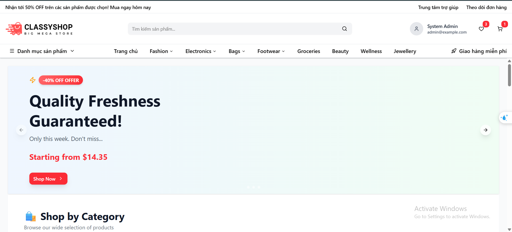
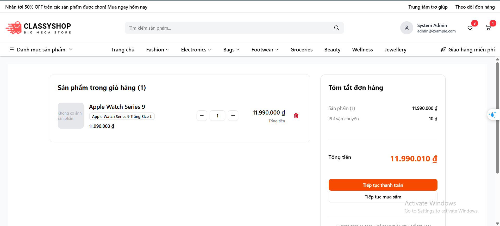
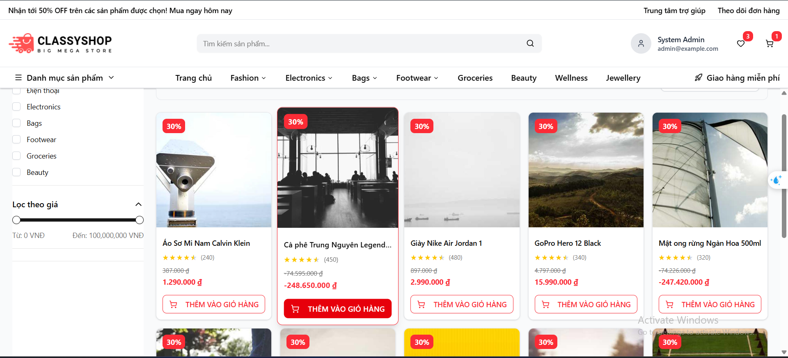
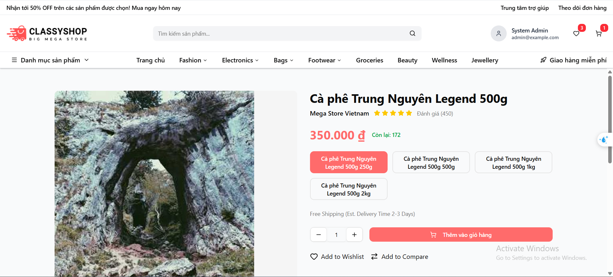
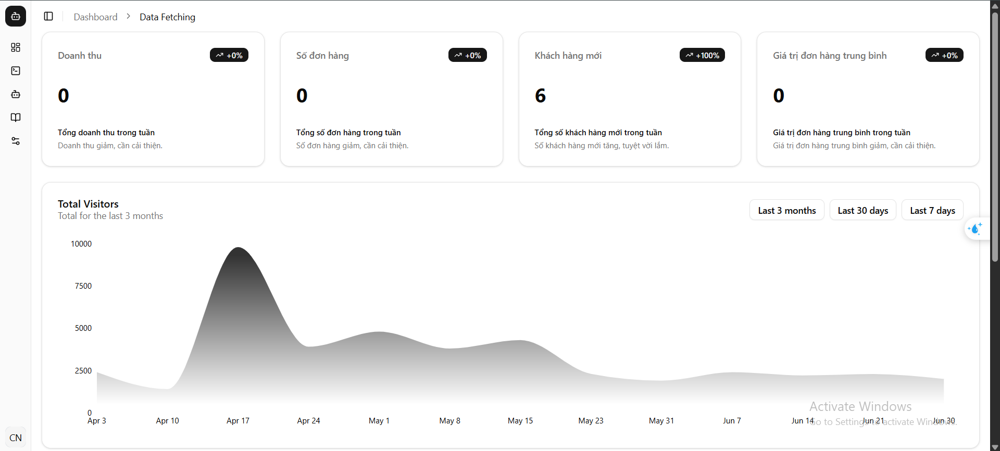

# E-Commerce Backend - ExpressJS + TypeScript

Hệ thống backend cho ứng dụng thương mại điện tử được xây dựng với ExpressJS, TypeScript, PostgreSQL và tích hợp blockchain để quản lý cashback.

## Thành viên nhóm

- **Lê Dũng Tiến** - **22810310329** - **Trưởng nhóm**
- **Nguyễn Trọng Quang** - **22810310333** - **Thành viên**
- **Nguyễn Minh Đức** - **22810310339** - **Thành viên**

## Công nghệ sử dụng

- **Framework**: ExpressJS

- **Ngôn ngữ**: TypeScript

- **Database**: PostgreSQL

- **ORM**: Prisma

- **Cache**: Redis

- **File Upload**: Cloudinary

- **Authentication**: JWT (JsonWebToken)

- **Validation**: Class Validator, Joi

- **Security**: Helmet, CORS, Rate Limiting

- **Blockchain**: Ethers.js (BSC, Ethereum, Polygon)

 

## Tính năng chính

- **Quản lý người dùng**: Đăng ký, đăng nhập, phân quyền (RBAC)

- **Quản lý shop**: KYC verification, approval workflow

- **Quản lý sản phẩm**: Products với variants và options

- **Quản lý danh mục**: Category hierarchy

- **Giỏ hàng**: Cart management cho cả user và guest

- **Đơn hàng**: Order processing với status tracking

- **Thanh toán**: Multiple payment methods

- **Cashback**: Blockchain-based cashback system

- **Activity Logging**: User activity tracking

## Cấu trúc thư mục

```

ecommerce-expressjs/

├── prisma/

│   ├── migrations/          # Database migrations

│   ├── schema.prisma        # Prisma schema definition

│   ├── seed.ts             # Database seeding script

│   └── seed_products.ts    # Product seeding script

│

├── src/

│   ├── config/             # Cấu hình ứng dụng

│   │   ├── database.ts     # PostgreSQL configuration

│   │   ├── redis.ts        # Redis configuration

│   │   ├── cloudinary.ts   # Cloudinary configuration

│   │   ├── prisma.ts       # Prisma client instance

│   │   └── container.ts    # Dependency injection container

│   │

│   ├── constants/          # Các hằng số của ứng dụng

│   │

│   ├── controllers/        # Xử lý HTTP requests

│   │   # Nhận request từ routes, gọi services, trả về response

│   │

│   ├── services/           # Business logic

│   │   # Chứa logic nghiệp vụ, điều phối các repositories

│   │

│   ├── repositories/       # Làm việc với database qua Prisma Client

│   │   # Data access layer, truy vấn trực tiếp database

│   │

│   ├── routes/             # Định nghĩa API routes

│   │   # Map HTTP methods và paths tới controllers

│   │

│   ├── middleware/         # Express middleware

│   │   # Authentication, authorization, validation, error handling

│   │

│   ├── validators/         # Request validation schemas

│   │   # Validate request body, params, query

│   │

│   ├── types/              # TypeScript type definitions

│   │   # Interfaces, types, enums cho TypeScript

│   │

│   ├── utils/              # Utility functions

│   │   # Helper functions, common utilities

│   │

│   ├── errors/             # Custom error classes

│   │   # Error handling và custom exceptions

│   │

│   ├── index.ts            # Entry point

│   └── server.ts           # Server setup

│

│

├── scripts/                # Utility scripts

│   ├── generate-ssl.js     # Generate SSL certificates

│   └── check-ssl.js        # Check SSL certificates

│

├── contracts/              # Smart contract ABIs

│

└── ssl/                    # SSL certificates (cho HTTPS)

```

## Yêu cầu hệ thống


- Node.js >= 18.x

- PostgreSQL >= 14.x

- Redis >= 6.x (optional, cho caching)

- npm hoặc yarn


## Cài đặt


### 1. Clone repository

 

```bash

git clone "https://github.com/dungtienne2108/ecommerce-expressjs.git"

cd ecommerce-expressjs

```

 

### 2. Cài đặt dependencies

```bash

npm install

```

### 3. Cấu hình môi trường

Tạo file `.env` trong thư mục gốc dự án với nội dung xem trong `.env.example`

### 4. Tạo database

Chạy lần lượt các lệnh sau để tạo database và seed dữ liệu:

 
```bash

# Tạo migration và apply vào database

npm run db:migrate

 

# Generate Prisma Client

npm run db:generate

 

# Seed dữ liệu mẫu

npm run db:seed

```

 

## Chạy ứng dụng

 

### Development mode

 

```bash

npm run dev

```

 

Server sẽ chạy tại: `http://localhost:5000`

## Tài khoản mặc định

 

Sau khi chạy `npm run db:seed`, bạn có thể đăng nhập với các tài khoản sau:

 

| Role | Email | Password |

|------|-------|----------|

| System Admin | admin@example.com | Ecommerce@123 |

| KYC Reviewer | kyc.reviewer@example.com | Ecommerce@123 |

| Seller 1 | seller1@example.com | Ecommerce@123 |

| Seller 2 | seller2@example.com | Ecommerce@123 |

| Customer | customer@example.com | Ecommerce@123 |

 

## Scripts có sẵn

```bash

# Development

npm run dev              # Chạy server ở chế độ development với nodemon

npm run dev:http         # Chạy server với HTTP (không HTTPS)

npm run debug            # Chạy server với debugger

 

# Build

npm run build            # Build TypeScript sang JavaScript

npm run clean            # Xóa thư mục dist

 

# Database

npm run db:generate      # Generate Prisma Client

npm run db:push          # Push schema changes to database

npm run db:migrate       # Tạo và apply migrations

npm run db:migrate:prod  # Apply migrations cho production

npm run db:studio        # Mở Prisma Studio

npm run db:reset         # Reset database

npm run db:seed          # Seed dữ liệu mẫu

npm run db:seedProducts  # Seed dữ liệu sản phẩm

 

# Testing

npm test                 # Chạy tất cả tests

npm run test:watch       # Chạy tests ở watch mode

npm run test:cov         # Chạy tests với coverage report

npm run test:integration # Chạy integration tests

npm run test:unit        # Chạy unit tests

 

# Code Quality

npm run lint             # Chạy ESLint

npm run lint:fix         # Tự động fix linting errors

npm run format           # Format code với Prettier

 

# SSL (Optional)

npm run generate-ssl     # Generate SSL certificates

npm run check-ssl        # Kiểm tra SSL certificates

```

 

## Architecture

 

### Kiến trúc dự án

 

Dự án sử dụng kiến trúc phân lớp (Layered Architecture):

 

1. **Routes Layer**: Định nghĩa API endpoints

2. **Controller Layer**: Xử lý HTTP requests/responses

3. **Service Layer**: Business logic

4. **Repository Layer**: Data access qua Prisma

5. **Database Layer**: PostgreSQL

 

### Flow của một request

 

```

Request → Routes → Middleware → Controller → Service → Repository → Database

                                    ↓

                                Response

```

 
## Database Schema

 

Dự án sử dụng Prisma ORM với PostgreSQL. Các bảng chính:

 

- **users**: Người dùng

- **roles**: Vai trò (Admin, Seller, Customer, KYC Reviewer)

- **permissions**: Quyền hạn

- **shops**: Cửa hàng

- **kyc_data**: Dữ liệu KYC verification

- **products**: Sản phẩm

- **product_variants**: Biến thể sản phẩm

- **categories**: Danh mục (hỗ trợ hierarchy)

- **carts**: Giỏ hàng

- **orders**: Đơn hàng

- **payments**: Thanh toán

- **cashbacks**: Hoàn tiền blockchain

 

Chi tiết schema xem tại: `prisma/schema.prisma`


### Base URL

```

http://localhost:5000/api/

```
 

### Xác thực

 

Hầu hết các endpoints yêu cầu JWT token trong header:

 

```

Authorization: Bearer <your_jwt_token>

```

 

## Bảo mật

 

- **Helmet**: Bảo vệ khỏi các lỗ hổng web phổ biến

- **CORS**: Cấu hình Cross-Origin Resource Sharing

- **Rate Limiting**: Giới hạn số request để chống DDoS

- **Password Hashing**: Sử dụng bcrypt với salt rounds = 12

- **JWT**: Token-based authentication

- **Input Validation**: Class-validator và Joi

- **SQL Injection Protection**: Prisma ORM

- **HTTPS Support**: Optional SSL/TLS

## Các kịch bản tấn công

Người dùng truy cập vào trang Admin → Trả về 401/403.

Người dùng gọi API Admin bằng Postman → Trả về 403.

Người dùng sửa ID trong API để chỉnh thông tin tài khoản người khác (IDOR) → Trả về 403/404.

Người dùng xem đơn hàng không thuộc sở hữu → Trả về 403/404.

Người dùng gửi request để tự cập nhật role thành ADMIN → Trả về 403.

Gửi request với token hết hạn hoặc không hợp lệ → Trả về 401.

Gọi API lấy danh sách tất cả đơn hàng → Chỉ trả về đơn hàng của chính user hoặc 403.

Chỉnh sửa payload JWT (fake role) → Backend từ chối vì signature sai.

Gửi request API không kèm token → Trả về 401.

Gọi API nhạy cảm dù UI đã ẩn chức năng → Trả về 403.

User tự cập nhật trạng thái đơn hàng → Trả về 403.


## Giao diện web






